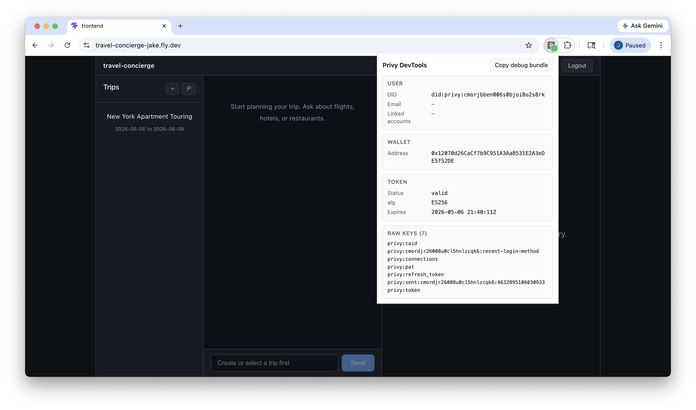

# Privy DevTools

A Manifest V3 Chrome extension that surfaces a page's Privy auth state in a popup. One click and you get the User DID, embedded wallet address, JWT decode (alg, expiry, status), and the full list of `privy:*` localStorage keys. The toolbar badge turns green on any page that has Privy state, gray/empty otherwise, so you can see at a glance whether a site is using Privy.



## Install

Until this is published to the Chrome Web Store, load it unpacked:

1. `npm install`
2. `npm run build`
3. Open `chrome://extensions`, enable Developer mode, click **Load unpacked**, select the `dist/` folder.
4. Pin the extension to the toolbar so the badge stays visible.

## What it does

- **Popup (click).** Reads `privy:*` keys from the active tab's `localStorage`, decodes the Privy access-token JWT (header alg + kid, payload sub/DID, expiry, status), and lifts the embedded wallet address from `privy:connections`. Renders four cards (User / Wallet / Token / Raw keys) plus a "Copy debug bundle" button that writes the parsed state to the clipboard as JSON.
- **Badge (ambient).** A background service worker subscribes to `chrome.tabs.onActivated` and `chrome.tabs.onUpdated`, injects a one-line presence-check into the active tab's MAIN world, and paints the toolbar badge green if any `privy:*` key exists. State doesn't survive between events (MV3 service workers are killed when idle), so every wake-up re-reads from scratch.

The localStorage read uses `chrome.scripting.executeScript({ world: "MAIN" })`. Default content-script injection runs in an *isolated world* sandboxed from the page; reading the page's `localStorage` requires the MAIN-world opt-in.

## Scope

- **Read-only.** Never writes to `localStorage`, never makes network calls, never persists anything.
- **Display-only JWT decode.** No signature verification; that's an auth concern, not a debug concern. Token status (`valid` / `expired`) is based on the `exp` claim alone.
- **Minimal permissions.** `activeTab` (read the current tab on click) and `scripting` (inject the read snippet). Nothing else.
- **Email isn't lifted.** Privy stores it in the user record on their backend, not in `localStorage`. The User card shows `—` for email by design.

## Build

```
npm install
npm run build         # → dist/
npm test              # vitest unit tests for the parser
npm run typecheck     # tsc --noEmit
```

The build produces `dist/popup.html`, `dist/assets/popup-<hash>.js`, `dist/background.js`, and `dist/manifest.json`. Load the `dist/` folder, not the repo root.

## Project layout

- `src/parser.ts` — pure `parsePrivyState(localStorage)` and `hasPrivyKeys(localStorage)` functions.
- `src/parser.test.ts` — vitest cases (full state, expired token, JSON-stringified token unwrap, empty state, wallet lift, malformed connections, presence predicate edges).
- `src/popup.tsx` — React popup.
- `src/background.ts` — MV3 service worker that paints the badge.
- `popup.html` / `popup.css` — popup shell.
- `manifest.json` — MV3 manifest.

## Non-goals

- DevTools panel, live SDK event listening, network filtering, Firefox port, Chrome Web Store publish. This is a single-button surface tool, on purpose.
